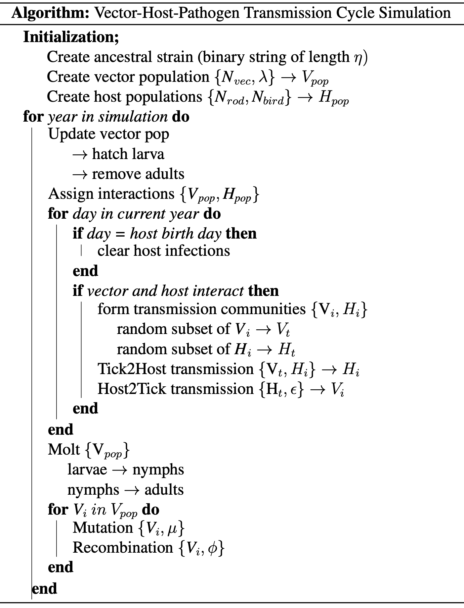

# Bb-strain-model
### An agent-based simulation of *Borrelia* strain evolution through vector-host transmission cycles

[](https://www.python.org/)
[](https://www.r-project.org/)
[](LICENSE)

---

## Overview

**Bb-strain-model** is an agent-based simulation framework for investigating the evolutionary and ecological forces that structure pathogen strain diversity in enzootic vector-host-pathogen transmission systems. The model is developed in the context of *Borrelia burgdorferi* — the causative agents of Lyme disease — and is motivated by two hypotheses in the literature regarding the maintenance of distinct, co-circulating strains in natural *Borrelia* populations:

1. **Immune selection** (via negative frequency-dependent selection) — rare strains are favoured because hosts have not yet developed immunity to them, generating generating antigenically distinct variants that lack host immune cross reactivity 
2. **Multiple niche polymorphism via host specialization** (adaptive selection) — strains are locally adapted to exploit different reservoir host species, partitioning the pathogen population along host lines

The simulation evolves a pathogen population from a single ancestral sequence at strain defining loci over simulated cycles of tick-host transmission, under four selectable evolutionary regimes. A simpler two-locus replication of the Gupta et al. framework is included and was used as a validation for this agent based stochastic approach.

---

## Biological Background

*Borrelia burgdorferi* is maintained in nature through a tick-vertebrate transmission cycle. *Ixodes* ticks serve as the vector, acquiring infection by feeding on reservoir hosts — primarily small rodents (e.g. *Peromyscus leucopus*) and passerine birds. Tick larvae can acquire infection from hosts during their first blood meal. They reemerge as nymphs and can transmit to new hosts the following season.

Field studies have documented that co-circulating *Borrelia* strains (defined by their *ospC* gene) are maintained at stable frequencies over many years — a pattern inconsistent with neutral genetic drift. Two main hypotheses have been proposed to explain this observation:

- Strains avoid competitive exclusion through **immune-mediated negative frequency-dependent selection**: hosts develop strain-specific immunity, creating an advantage for strains with greater antigen sequence distances (ref)
- Strains are ecologically partitioned by **host specialization**: some strains are adapted to infect rodents more effectively while others infect birds, reducing direct competition between strains (ref)

This simulation was developed to explore how each selective force, independently and in combination, shapes the emergent structure of pathogen populations over evolutionary time.

---

## Model Structure


### Agent Classes

| Agent | Description |
|---|---|
| `Vector` | Tick population, split into larval and nymphal stages. Larvae are uninfected at hatch; nymphs carry strains acquired as larvae. Each year, larvae molt to nymphs and a new larval cohort hatches. |
| `Host` | Vertebrate reservoir population, composed of rodents and birds in user-defined proportions. Each host has a birth day (simulating annual turnover) at which infection history is cleared. |
| `Pathogen` | Strains carried within individual ticks and hosts, represented as dictionaries tracking gene sequence, lineage ID, and mutation/recombination history. Gene are represented as a **binary string** of user-defined length (*η* bits), analogous to a simplified antigenic gene sequence (e.g. *ospC*). The simulation begins with a single ancestral sequence and diversifies through per-site mutation and recombination during the transmission cycle.|


### Selection Regimes

The transmission probability from tick to host is modulated by the active selection mode:

| Mode | Mechanism | Transmission probability |
|---|---|---|
| `immune` | Immune-mediated negative frequency-dependent selection | Sigmoid function of Hamming distance between incoming strain and host's existing infections; antigenically distant strains transmit more readily |
| `adaptive` | Host specialization / multiple niche polymorphism | Fitness function of the strain's adaptive trait value and host species identity; specialist strains have high fitness in their preferred host |
| `none` | No selection (genetic drift baseline) | Fixed probability; all strains transmit equally regardless of host immune history or host species |
| `hybrid` | Combined immune + adaptive selection | Transmission requires passing both an immune distance threshold and a host-specialization fitness check, weighted equally |


### Simulation Algorithm

The simulation proceeds in discrete annual cycles. Within each year, daily resolution is used to schedule tick-host interactions. The full algorithm is illustrated below.



---

## Running the simulation

### Core Simulation: `evo_strain_model_sim.py`

The main simulation script. Initialises vector and host populations, runs the annual transmission cycle for a user-specified number of years under a chosen selection regime, and writes output files tracking strain diversity, infection rates, and allele frequencies.

**Usage:**
```bash
# Immune selection, single gene
python evo_strain_model_sim.py \
  -selection immune \
  -gene single \
  -len 20 \
  -mut 0.01 \
  -rec 0.01 \
  -vec 5000 \
  -rodents 50 \
  -birds 50 \
  -yrs 500 \
  -out results/immune_run

# Hybrid selection, multi-gene
python evo_strain_model_sim.py \
  -selection hybrid \
  -gene multi \
  -len 20 \
  -gen_fit low \
  -vec 5000 \
  -rodents 50 \
  -birds 50 \
  -yrs 500 \
  -out results/hybrid_run

# Batch runs: use -run_tag to append multiple runs to the same output files
for i in $(seq 1 20); do
  python evo_strain_model_sim.py -selection immune -gene single -len 20 \
    -vec 5000 -rodents 50 -birds 50 -yrs 500 \
    -run_tag $i -out results/immune_batch
done
```

**Key Arguments:**

| Argument | Description | Default |
|---|---|---|
| `-selection` | Selection regime: `immune`, `adaptive`, `neutral`, `hybrid` | required |
| `-gene` | Gene architecture: `single`, `modular`, `multi` | `single` |
| `-len` | Length of binary antigen sequence (must be even) | `20` |
| `-gen_fit` | Generalist fitness under adaptive selection: `low`, `high`, `moderate` | `low` |
| `-mut` | Per-site mutation rate | `0.01` |
| `-rec` | Per-site recombination rate | `0.01` |
| `-vec` | Vector (tick) population size (must be even) | `5000` |
| `-rodents` | Rodent host population size | `50` |
| `-birds` | Bird host population size | `50` |
| `-flux` | Enable stochastic host species population fluctuation: `on`/`off` | `off` |
| `-yrs` | Number of years to simulate | `500` |
| `-run_tag` | Unique integer ID for batch runs; controls header writing | `1` |
| `-out` | Output file prefix | — |

**Outputs:**

| File | Contents |
|---|---|
| `<prefix>_sim_data.tsv` | Per-year infection rate, unique lineage count, mean antigenic distance, specialisation weight |
| `<prefix>_variant_freqs_sampled.tsv` | Final sampled variant frequencies across the tick population |
| `<prefix>_host_infection_freqs.tsv` | Final strain frequencies broken down by host species (rodent vs. bird) |
| `<prefix>_pw_dists_sampled.tsv` | Pairwise Hamming distances between sampled strains at end of simulation |
| `<prefix>_adpt_vals_sampled.tsv` | Sampled adaptive trait values (adaptive/hybrid modes only) |
| `<prefix>_adpt_gene_freqs_sampled.tsv` | Adaptive gene variant frequencies (multi gene type only) |

---

### Validation Model: `gupta_strain_model_sim.py`

A reimplementation of the Gupta et al. (1996) two-locus, two-allele model with recombination, used to validate that the simulation framework recapitulates the expected result: immune selection acting on recombining pathogens maintains distinct strain identities (defined by allele combinations) rather than allowing them to collapse into a well-mixed population. This replication provides confidence in the transmission and immune selection mechanics before extending to the more complex evolutionary model.

**Usage:**
```bash
python gupta_strain_model_sim.py \
  -vec 1000 \
  -hosts 100 \
  -yrs 200 \
  -rec 0.01 \
  -run_tag 1 \
  -out results/gupta_validation
```

| Argument | Description | Default |
|---|---|---|
| `-vec` | Vector population size (must be even, minimum 50) | required |
| `-hosts` | Host population size | required |
| `-yrs` | Number of years to simulate | required |
| `-rec` | Recombination rate | `0.01` |
| `-run_tag` | Batch run identifier | `1` |
| `-out` | Output file prefix | — |

---

### Analysis and Visualisation (R)

The `analysis/` and `visualization/` directories contain R scripts for downstream processing and figure generation from simulation output TSV files. These scripts handle multi-run batch aggregation, statistical comparisons across selection regimes, and production of figures.

---

## Dependencies

**Python:**

| Package | Usage |
|---|---|
| `numpy` | Poisson sampling, bitstring operations |
| `scipy` | (gupta model) statistical utilities |
| `tqdm` | Progress bar for long simulation runs |
| `pandas` | Output file generation |

---

## Scientific Context and Hypotheses Tested

This simulation directly addresses the following hypotheses regarding *Borrelia* strain structure:

**H1 — Immune selection is sufficient to maintain strain diversity**
Under the `immune` regime, strains accumulate antigenic divergence driven by host immune pressure. Rare, antigenically distinct strains gain a transmission advantage, generating negative frequency-dependent selection that stabilises strain coexistence.

**H2 — Host specialization alone structures strain populations along host lines**
Under the `adaptive` regime, strains diverge toward specialist phenotypes adapted to either rodents or birds. Population structure reflects host community composition rather than immune history.

**H3 — Combined selection (hybrid) produces qualitatively distinct population structure**
Under the `hybrid` regime, both forces act simultaneously. The relative contribution of each and whether they act synergistically or antagonistically on strain diversity is an empirical output of the simulation.

**H0 — No selection produces no stable strain structure**
Under the `none` regime, transmission is independent of antigenic identity and host species. This serves as a genetic drift baseline; any strain structure observed under selection regimes can be attributed to the selective force rather than demographic stochasticity.

---

## Citation

If you use or adapt this simulation in your research, please cite:

> [Brandon Ely] (2026). The Emergence, Maintenance, and Diveristy of Strains in Microbial Pathogen Populations* [City Univeristy of New York, Hunter College / https://github.com/bely12/bb_strain_model]

---

## License

MIT License. See [LICENSE](LICENSE) for details.
